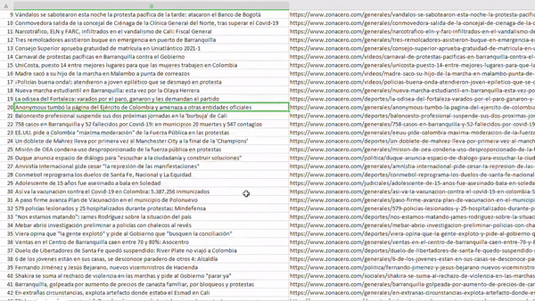

# Scrapping Colombian Newspapers

:shipit: Scrapping information of Colombian newspapers.

## Getting Started

Repository that captures information from Colombian newspapers (list of newspapers), then generates a csv with all the
information.
<h1 align="center" >
    
</h1>

### Prerequisites

Pip and Python installed and configured as environment variables. Then, install pipenv.

Create a folder and inside it execute the next commands:

To isolate the environment:

```
python -m venv .venv
```

To activate the enviroment in Windows:

```
\Scripts\activate.bat
```

Installing the dependencies:

```
pip install -r requirements.txt
```

Run the code:

```
python scrap/main.py
```

Will be generated a csv or json or xml all_news.(csv|json|xml) with all the information captured at the moment of the
execution of the line above.

At the moment, the list of scrapped sites is [20]:

- elheraldo
- zonacero
- elpilon
- eluniversal
- diariodelcesar
- hoydiariodelmagdalena
- diariodelnorte
- laopinion
- eltiempo
- elcolombiano
- elespectador
- lapatria
- elpais
- elmundo
- elnuevodia
- elmanduco
- semana
- publimetro
- pulzo
- larepublica
